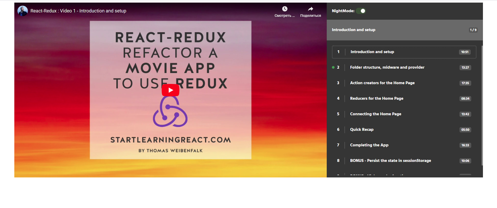

# React Video Player
## Description: 
Custom Video Player with React. 

## The outcome: 

## The Stack: 
The app built with **React.js** and use [**React Styled Components**](https://styled-components.com/), [**React Router Dom**](https://github.com/ReactTraining/react-router), [**React Player**](https://www.npmjs.com/package/react-player) and browser's local storage.

## The version: 
Completed

## The online demo: 
[**DEMO**](https://morning-cool-1dt6r2.netlify.app/)

